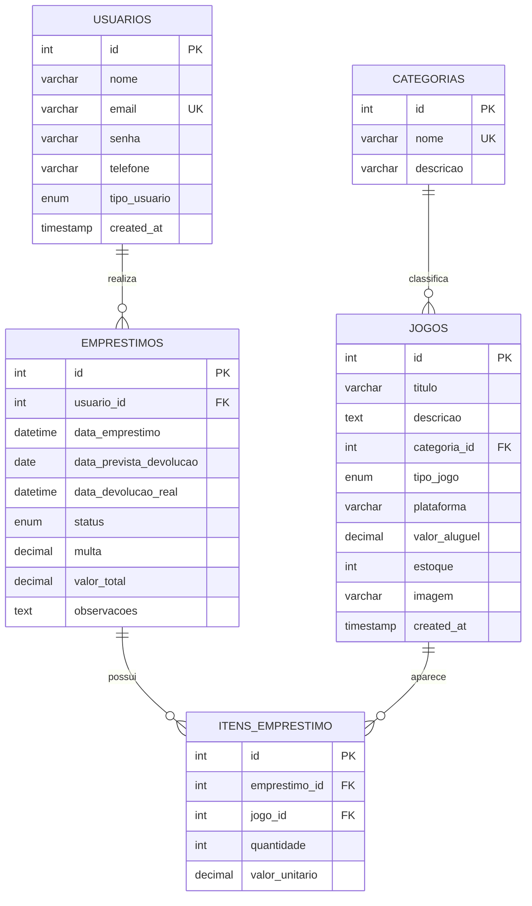

# Diagrama Entidade-Relacionamento

Relacionamentos obrigatorios atendidos:

- `usuarios` 1:N `emprestimos`
- `categorias` 1:N `jogos`
- `emprestimos` N:N `jogos` por meio de `itens_emprestimo`

Observacoes de dominio:

- `usuarios.tipo_usuario`: `admin` ou `usuario`
- `jogos.tipo_jogo`: `videogame` ou `boardgame`
- `emprestimos.status`: `pendente`, `aprovado`, `retirado`, `devolvido`, `cancelado` ou `atrasado`
